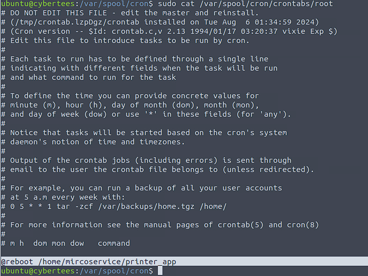
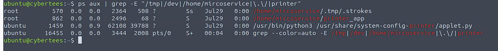
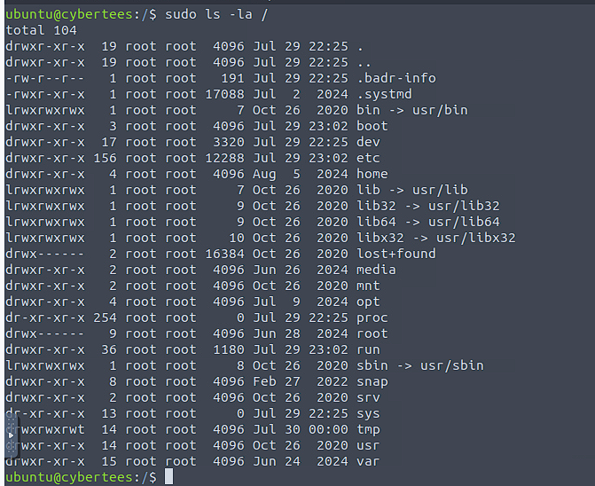
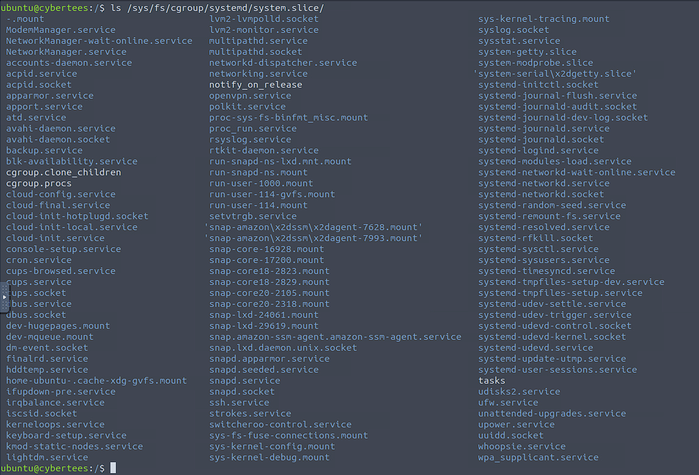
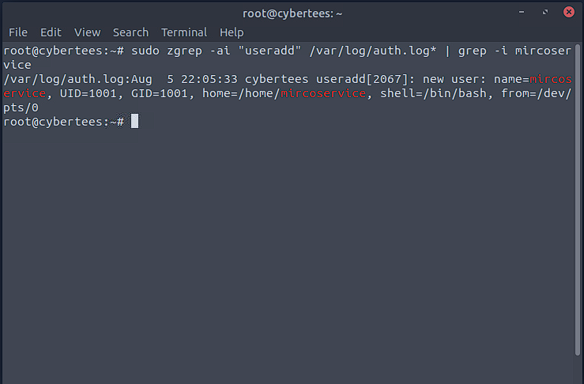
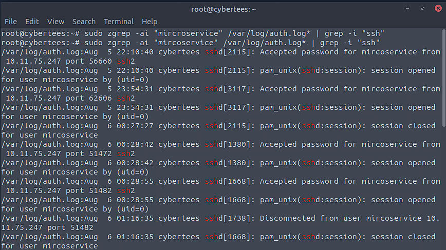
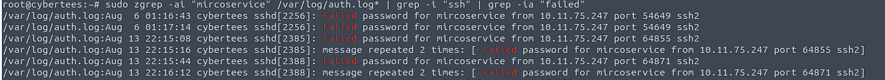

# IronShade - TryHackMe Challenge
**Objective**: Documenting my analysis and learnings from the IronShade room.

## Task 1 - Identify Machine ID

- **Command used**:
- ```bash
  cat /etc/machine-id

  Output:
  dc7c8ac5c09a4bbfaf3d09d399f10d96

What I learned:
Every Linux system has a unique ID stored at etc/machine-id


## Task 2 - Identify Backdoor User Account
- **Command used**:
- ```bash
  cat /etc/passwd

What I was looking for:
I reviewed all user accounts defined on the system to identify any unusual or suspicious users.

What I found:
A suspicious user account named microservice existed, which stands out since it's not part of the default Linux users.


What I Learned:
The etc/passwd file contains all user accounts on a Linux system. Attackers often create new accounts for persistence, and spotting unfamiliar names like microservice can reveal backdoors.

## Task 3 - Detect Malicious Cronjob
- **Command used**:
- ```bash
  sudo cat /var/spool/cron/crontabs/root



What I was looking for:
I reviewed scheduled tasks under root to identify any jobs set to automatically execute malicious scripts at boot, which is a known attacker tactic for persistence.

What I found:
A suspicious cronjob set to execute /home/mircroservice/printer_app every time the machine reboots, likely tied to the mircroservice backdoor user.

## Task 4 - Identify Hidden Process
- **Command Used**:
- ```bash
  ps aux | grep -E "/tmp|/dev|/home/mircroservice|\.\/|printer"



What I was looking for:
I scanned all active processes running from suspicious locations (like /tmp, /home/mircroservice) that might belong to a backdoor account or be disguised as a system process.

What I found:
A process named .strokes running from a hidden directory:
/home/mircroservice/.tmp/.strokes

## Task 5 - Count Processes from Backdoor Directory
- **Command Used**:
- ```bash
  ps aux | grep -E "/tmp|/dev|/home/mircroservice|\.\/|printer"


What I was looking for:
I searched all active processes to determine how many were running from within the backdoor user’s home directory: /home/mircroservice.

What I found:
Two suspicious processes:

/home/mircroservice/.tmp/.strokes

/home/mircroservice/printer_app

Both were owned by root and running from a non-standard, attacker-created directory.

Correct answer: 2

## Task 6 - Identify Hidden File from the Root (/) Directory 
- **Command Used**:
- ```bash
  sudo ls -la /



What I was looking for:
I searched for hidden files located directly under the root of the filesystem (/) — not the /root user's home directory. These files can signal stealthy attacker implants or dropped payloads.

What I found:
A file named .systemd, which is attempting to blend in with legitimate system services. Its location in / and hidden nature is highly suspicious.

## Task 7 - Identify Suspicious Services 
- **Command used**:
- ```bash
  ls /sys/fs/cgroup/systemd/system.slice/

  


What I was looking for:
I inspected services listed in the system.slice cgroup, which may include stealthy or manually dropped service files that don’t appear via standard systemctl listing.

What I found:
Two suspicious services:

backup.service – Not a legitimate system component and likely used to disguise a backdoor.

strokes.service – Matches the previously identified .strokes binary used for persistence.

These services do not belong to standard Linux operations and are likely attacker-created.

Correct answer: 
backup.service, strokes.service

## Task 8 - Identify when a suspicious user (`mircroservice`) was created
- **Command Used**:
- ```bash
  sudo zgrep -ai "useradd" /var/log/auth.log* | grep -i mircoservice



What I was looking for:
I searched the authentication logs to identify when the suspicious user mircroservice was created using the useradd command.

What I found:
On August 5 at 22:05:33, a new user named mircroservice was created. This is not a default Linux user and matches the backdoor account we identified earlier.

## Task 9 - Identify Remote SSH Connections to Backdoor Account
- **Command Used**:
- ```bash
  sudo zgrep -ai "microservice" /var/log/auth.log* | grep -i "ssh"



What I was looking for:
I needed to determine which external IP address had established multiple SSH sessions to the suspicious backdoor account named microservice.

What I found:
The command output revealed repeated successful SSH logins to the microservice user from the IP address 10.11.75.247. These logins occurred across several timestamps, confirming multiple connections.

Correct answer: 10.11.75.247

## Task 10 - Count Failed SSH Logins on Backdoor Account
- **Command Used**:
- ```bash
  sudo zgrep -ai "mircoservice" /var/log/auth.log* | grep -i "ssh" | grep -ia "failed"



What I was looking for:
I wanted to identify how many failed SSH login attempts were made to the mircoservice backdoor account. Failed attempts can indicate brute-force attacks or probing by the attacker after account creation.

What I found:
A total of 8 failed login attempts were recorded for the microservice account. Some were shown as "repeated" log messages, which required me to add them manually:
message repeated 2 times means the previous failed message happened 2 more times.

Correct answer: 8

## Task 11 - Identify Malicious Package Installed on Host
- **Command Used**:
- ```bash
  grep "install" /var/log/dpkg.log
  


What I Was Looking For:
I wanted to see all installed packages on the host and identify if anything suspicious was manually installed by the attacker.

What I Found:
Among many system packages, one unusual package stood out:
pscanner:amd64

This package isn’t a standard part of any normal Ubuntu system and doesn’t appear to have been installed from a trusted repo.

It was likely manually added to the system by the attacker.

What I Learned:
/var/log/dpkg.log keeps track of all packages installed using the dpkg tool or indirectly through apt.
Searching it is a common forensic technique to discover post-exploitation payloads or malware masquerading as system tools.
Anything unfamiliar (like pscanner) should raise immediate suspicion and be investigated further.


