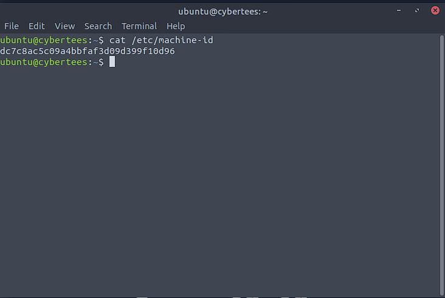
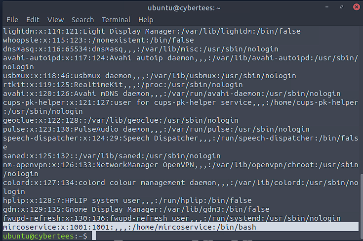

# IronShade - TryHackMe Challenge
**Objective**: Documenting my analysis and learnings from the IronShade room.

## Task 1 - Identify Machine ID

- **Command used**:
- ```bash
  cat /etc/machine-id

  Output:
  dc7c8ac5c09a4bbfaf3d09d399f10d96

What I learned:
Every Linux system has a unique ID stored at etc/machine-id



## Task 2 - Identify Backdoor User Account
- **Command used**:
- ```bash
  cat /etc/passwd

What I was looking for:
I reviewed all user accounts defined on the system to identify any unusual or suspicious users.

What I found:
A suspicious user account named microservice existed, which stands out since it's not part of the default Linux users.



What I Learned:
The etc/passwd file contains all user accounts on a Linux system. Attackers often create new accounts for persistence, and spotting unfamiliar names like microservice can reveal backdoors.
